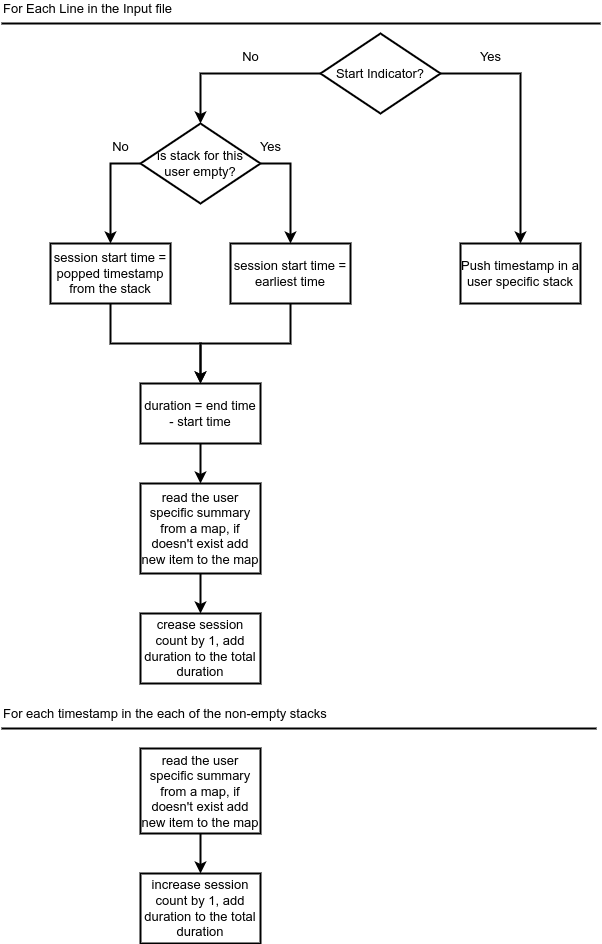
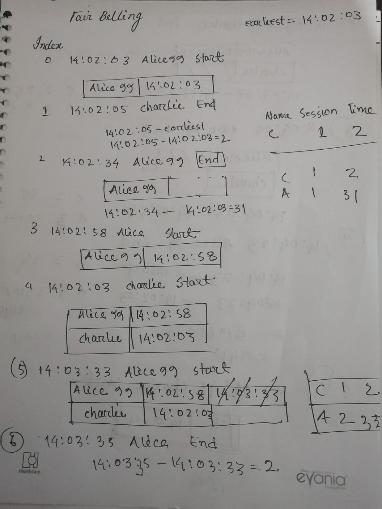
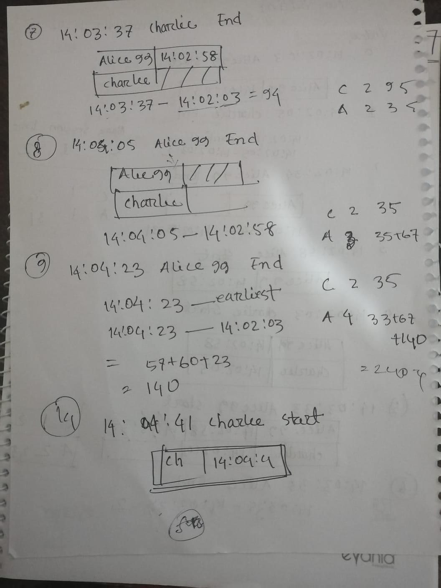
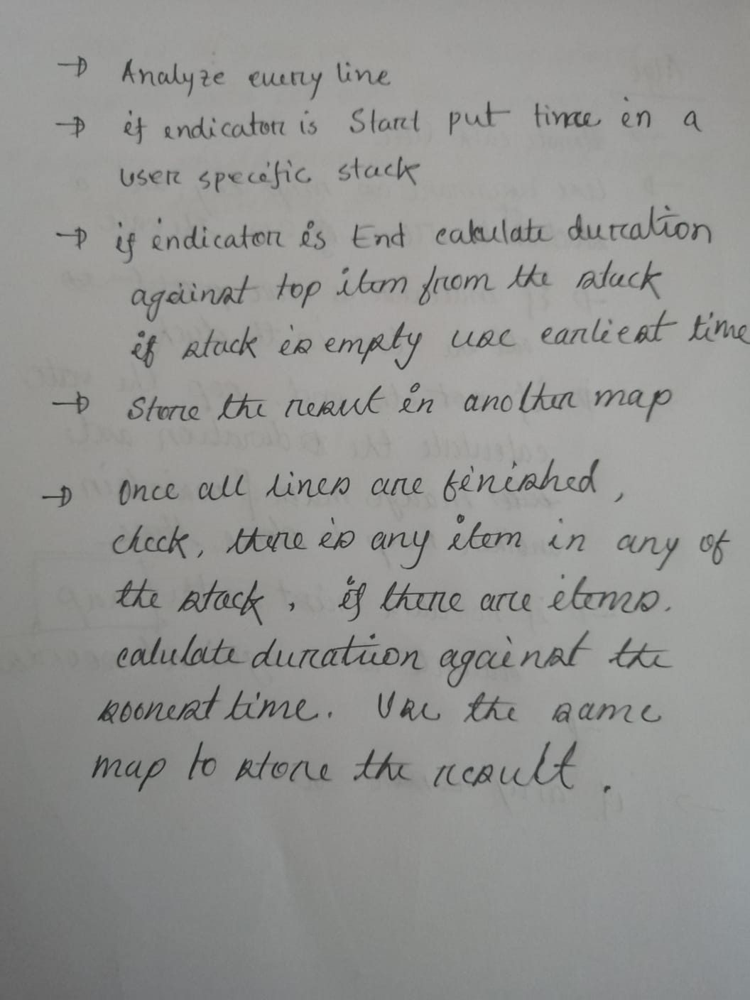

# Fair Billing Console Application 

This is a **console application** that simulates a fair billing policy of a hosted application provider company. 
The application reads the usage records from a file and calculates the minimum total session duration and total number of sessions for each customer.
The application is written in Java 8 and do not use any external libraries.

**Disclaimer:** The application has maven project structure and the code is written in Java 8 (build 1.8.0_202-b08). 
Maven project is used to make it easy to manage the dependencies required to test the application. 
Application is still a **console application** and can be run from the command line using java runtime environment. 

## Technologies Used
- **Java**: Build 1.8.0_202-b08
- **Maven**: Version 3.6.3
- **JUnit**: Version 5.10.2

## Project Structure
```
.
└── src
    ├── main
    │   └── java
    │       ├── Main.java
    │       ├── constant
    │       │   └── AppConstants.java
    │       ├── exception
    │       │   └── AppException.java
    │       ├── model
    │       │   └── UsageSummary.java
    │       ├── service
    │       │   ├── ConsoleOutputService.java
    │       │   └── SessionAnalyzerService.java
    │       └── utils
    │           ├── AppUtils.java
    │           └── ValidationUtils.java
    └── test
        └── java
            ├── service
            │   ├── ConsoleOutputServiceTest.java
            │   └── SessionAnalyzerServiceTest.java
            └── MainTest.java
├── pom.xml
├── .gitignore
└── readme.md

```

## Sample Input & Assumptions
- The input file can be very large, so the application reads the file line by line.
- The usage data in every line may not be in the standard format -  
  - Each line may have preceding or trailing spaces.
  - Each data field may have multiple spaces between them. (The followings should be considered valid input):
    ```
    14:02:03 ALICE99 Start
         14:02:05 CHARLIE End
    14:02:34        ALICE99 End
    14:02:58 ALICE99            Start      
    14:03:02        CHARLIE     Start
    14:03:33 ALICE99 Start
    ```
- The terminal command to run the application may have multiple arguments with invalid file names.

## How to Compile and Run
Please ensure that Java 8 is installed on your computer and that the Java Runtime Environment (`java`) and Java Compiler (`javac`) are available in your classpath.  
- Open your terminal and navigate to the root directory of the Java source code:
```bash
cd /src/main/java  
```
- Compile all .java files inside all packages:
```bash
javac **/*.java  
```
- Copy your input file into the root directory of the Java source code:
```bash
cp /path/to/your/input/file.txt /src/main/java  
```
- To run the application, execute the following command in the terminal:
```bash
java Main your_file_name.txt
```
There is a sample input file `input.txt` in the `resources `directory. 

***IMPORTANT**: If you pass multiple arguments, the application will consider the first valid one (the one with `.txt` extension).  Please replace /path/to/your/input/file.txt with the actual path to your input file, and replace your_file_name.txt with the actual name of your input file

## How to Run Tests
The application uses JUnit for testing. To run the tests execute the following command in the terminal:
```bash
mvn clean test
```

## Flow Chart



## Working out



